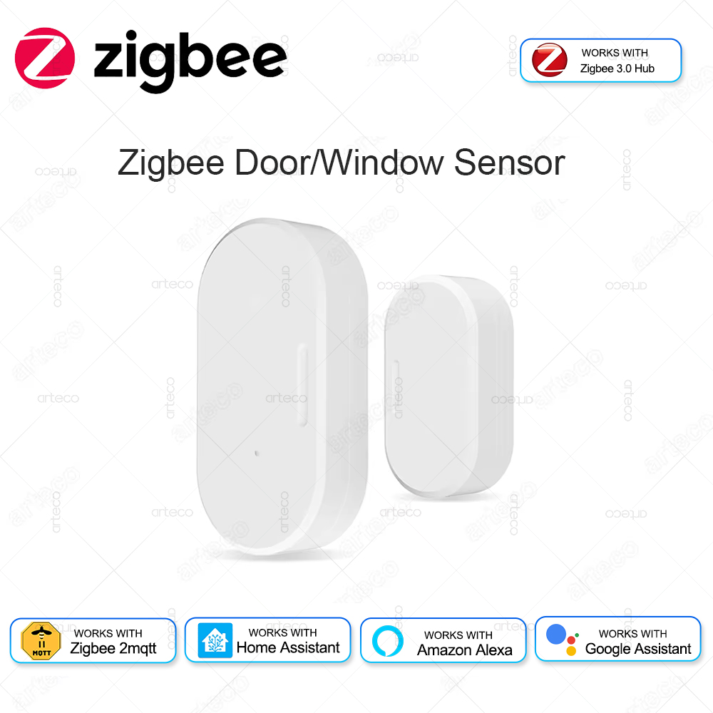
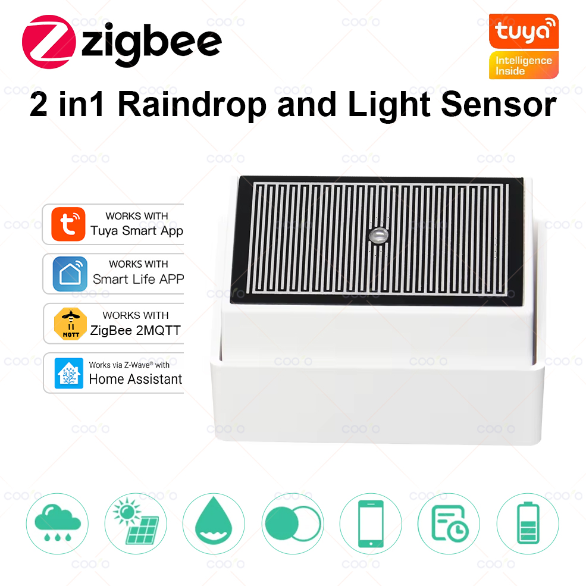
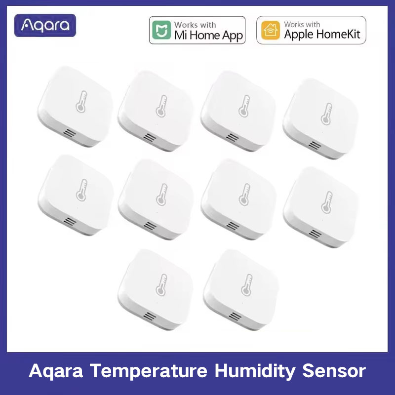

# Pluviómetro basculante Zigbee para Home Assistant

> 🇬🇧 [English version](README.md)

Pluviómetro DIY de balancín (*tipping bucket*) diseñado en Fusion 360, impreso en ASA y leído con un **sensor de puerta Zigbee** (imán + reed) integrado en Home Assistant. Comparte estructura con una **pantalla Stevenson** que protege un sensor de temperatura, humedad y presión, y lleva un sensor de lluvia de placa en el lateral.

<p align="center">
  
</p>

## Características

| Parámetro | Valor |
|---|---|
| Área de captación | **100 cm²** (boca cuadrada R20 mm, lado ≈ 101,7 mm) |
| Volumen por vuelco | **5 ml** → **0,5 mm** de lluvia |
| Sensor de vuelcos | Sensor de puerta Zigbee (`binary_sensor.puerta_1_contact`), sin ESP |
| Material | ASA (resistente a UV e intemperie) |
| Eje del balancín | Acero inoxidable Ø2,5 mm alojado directamente en el ASA |
| Topes | Tornillos M3 que se atornillan en la pieza y regulan el ángulo de disparo |
| Imán | Imán de neodimio de Ø3 × 2 mm en el balancín, activa el reed del sensor de puerta |
| Extras | Pantalla Stevenson, sensor de lluvia de placa, alerta de tormenta |

## Sensores Zigbee usados

| | Sensor | Uso | Enlace |
|---|---|---|---|
|  | Sensor de puerta (reed) | Cuenta los vuelcos del balancín | [AliExpress](https://es.aliexpress.com/item/1005007307128850.html) |
|  | Sensor de lluvia de placa + luz (Tuya) | Detecta lluvia y mide la iluminación | [AliExpress](https://es.aliexpress.com/item/1005009511764724.html) ⚠️ **no lo recomiendo** |
|  | Aqara temperatura / humedad / presión | Dentro de la pantalla Stevenson | [AliExpress](https://es.aliexpress.com/item/1005007499860935.html) |

## Archivos

| Archivo | Descripción |
|---|---|
| [`rainmeter.yaml`](rainmeter.yaml) | *Package* de Home Assistant: contadores, sensores de lluvia/flujo, `utility_meter`, tendencia de presión y alerta de tormenta |
| [`dashboard.yaml`](dashboard.yaml) | Tarjeta de dashboard de la estación meteorológica |
| [`embudo.3mf`](embudo.3mf) | Proyecto de impresión (Bambu Studio) |
| [`3D source/`](3D%20source/) | Fuentes del modelo: `pluviometro.f3z` (Fusion 360) y `pluviometro.step` |

## Instalación en Home Assistant

1. En `configuration.yaml`:

   ```yaml
   homeassistant:
     packages: !include_dir_named packages
   ```

2. Copia `rainmeter.yaml` a `<config>/packages/rainmeter.yaml`.
3. Ajusta los `entity_id` a tu hardware (`binary_sensor.puerta_1_contact`, `sensor.termometro_exterior_pressure`).
4. Reinicia HA (o recarga `counter`, `input_datetime` y `template`; `utility_meter` necesita reinicio).
5. Pega `dashboard.yaml` en una tarjeta manual. Usa tarjetas personalizadas de HACS (`mushroom`, `mini-graph-card`, `expander-card`, `card-mod`).


### Entidades principales

| Entidad | Descripción |
|---|---|
| `counter.rainmeter_tip_count_calibration` | Vuelcos de la sesión de calibración (se resetea a mano) |
| `counter.rainmeter_tip_count_total` | Vuelcos totales (nunca se resetea, alimenta los `utility_meter`) |
| `sensor.rainmeter_rain_accumulated` | Lluvia acumulada en la sesión (mm) |
| `sensor.rainmeter_flow_rate` | Flujo medio de la sesión (mL/s) |
| `sensor.rainmeter_rain_rate_hourly` | Lluvia de la hora actual (mm/h) |
| `sensor.rainmeter_rain_rate_daily` | Lluvia del día actual (mm/24h) |
| `sensor.rainmeter_pressure_trend` | Tendencia de presión (hPa/h) |

### Conversiones

- Vuelcos → mm: `vuelcos × 0,5`
- mm → mL (100 cm²): `mm × 10`
- mL/s → mm/h (100 cm²): `mL/s × 360`

## Calibración de los tornillos de tope

Necesitas una jeringuilla de 5 ml y una medida de 100 ml.

> **Nivela el pluviómetro antes de calibrar.** Si está inclinado, un lado vuelca antes que el otro y la calibración no vale.

### 1. Ajustar cada lado (4,6 ml)
1. Deja el balancín apoyado en un lado.
2. Con la jeringuilla, echa **4,6 ml** poco a poco en la cazoleta de arriba.
3. Ajusta el tornillo M3 del tope de ese lado hasta que vuelque justo al llegar a 4,6 ml. Si vuelca antes o después, gira el tornillo y repite.
4. Haz lo mismo con el otro lado.

Se calibra a 4,6 ml y no a 5 ml por dos motivos:
- Mientras el balancín gira sigue entrando agua.
- En la cazoleta siempre quedan algunas gotas pegadas después de cada vuelco. El diseño intenta minimizarlas, pero no desaparecen del todo.

Con eso, cada vuelco acaba siendo de unos 5 ml, que es lo que cuenta `rainmeter.yaml`.

### 2. Validar con 100 ml
1. Resetea el contador con el botón **Resetear contador** del dashboard (`counter.rainmeter_tip_count_calibration`).
2. Vierte **100 ml muy despacio** en la boca del pluviómetro.
3. Debe marcar **20 vuelcos** (Acumulado = 10 mm).
4. El sensor **Flujo** (`sensor.rainmeter_flow_rate`) no debe pasar de **6 ml/s**. A 12 ml/s se pierde ~15 % (ver [Prueba de caudal](#prueba-de-caudal)).

Si salen más de 20 vuelcos, cada vuelco lleva menos de 5 ml: ajusta los topes para que vuelque con un poco más de agua. Si salen menos, al revés. Repite hasta que salgan 20.

### 3. Comprobar de nuevo en la instalación final
Cuando esté montado en su sitio, nivélalo otra vez y comprueba con la jeringuilla que cada lado sigue volcando con 4,6 ml, o con el volumen que te haya salido bien en la prueba de 100 ml. Al atornillar el soporte puede quedar algo inclinado y cambiar el punto de vuelco. Si un lado ha cambiado, reajusta su tornillo de tope.

## Notas de diseño

### Balancín
- Doble cazoleta en V (pared 1,6 mm) sobre un **eje de acero inoxidable de Ø2,5 mm**, con **topes de tornillos M3** que se atornillan en la pieza y fijan el ángulo de disparo.
- Objetivo de calibración, el mismo que usa `rainmeter.yaml`: **5 ml por vuelco = 0,5 mm** de lluvia sobre 100 cm².
- **Altura del eje:** más alto = vuelco más franco pero necesita más ángulo; muy bajo = disparo "nervioso".
- **Chaflán** hacia el eje: aleja el CG del agua y hace que dispare antes. La **profundidad** de la cazoleta fue la palanca más eficiente para subir volumen.
- Equilibrio en el disparo: `m_agua · d_agua = m_cuerpo · d_cuerpo` (CG del agua medido en Fusion con *Boundary Fill*).
- Con poco recorrido angular tras el disparo quedan gotas retenidas; con ~20° apenas quedan.

### Entrada del agua
- Se eliminó la cuña central: catapultaba el agua fuera. Mejor que caiga en la esquina de la cazoleta.
- Rejilla antihojas de malla ancha (las finas salpican y se obstruyen).

### Conteo asimétrico (resuelto)
Al bascular a un lado contaba 2 veces y al otro 1 (o 0). No era software: el sensor no quedaba centrado respecto a las dos posiciones del imán. **Desplazar el sensor 13 mm** lo solucionó.

Por eso `rainmeter.yaml` **no lleva debounce**. La automatización `Rainmeter - Increment tip counters` salta con cada cambio `off → on` de `binary_sensor.puerta_1_contact`, suma uno a los dos contadores y usa `mode: queued` para no perder vuelcos seguidos.

### Prueba de caudal
Se mide con `sensor.rainmeter_flow_rate`, que calcula `(vuelcos × 5) / segundos`. Los segundos van desde el primer vuelco de la sesión (`input_datetime.rainmeter_flow_start_time`) hasta el último. Es un flujo medio, pensado para calibrar, no una tasa de lluvia instantánea. Para pasarlo a mm/h: `mL/s × 360`.

- 6 ml/s (≈ 2160 mm/h) → lectura correcta (200 ml de 200 ml).
- 12 ml/s (≈ 4320 mm/h) → ~15 % de pérdida.
- Ambos muy por encima de cualquier lluvia real (récords de ~300 mm/h en 1 min).

### Alerta de tormenta
Un sensor `derivative` (`sensor.rainmeter_pressure_trend`, ventana de 20 min) calcula la tendencia de presión en hPa/h a partir de `sensor.termometro_exterior_pressure`. La automatización `Rainmeter - Storm Warning`:

- Salta cuando la tendencia baja de **−3 hPa/h** (tormenta acercándose) o sube de **+3 hPa/h** (frente de racha ya llegando), mantenida **2 min**.
- Tiene un **enfriamiento de 90 min**, para que la recuperación de la presión tras un pico no cuente como una tormenta nueva.
- Envía `notify.notify` y una `persistent_notification` con `notification_id` fijo (se actualiza en vez de acumularse).

**Por qué 20 min de ventana:** se simuló la derivada con 10 días de historial de presión, que incluían la tormenta del 03/10/2026. Con 30 min la tendencia apenas llegó a +3,2 hPa/h y no se mantuvo 2 min, así que **no habría avisado**. Con 20 min habría avisado unos 14 min antes de la lluvia fuerte, sin ninguna falsa alarma en esos 10 días. Con 15 min o menos, los escalones de 0,1 hPa del sensor ya generan falsas alarmas.

### Cuidados con el sensor Zigbee
- Los sensores de puerta no son estancos: aislar reed e imán del agua.
- Latencia Zigbee y consumo de batería con lluvia muy intensa.

## Galería

### Instalado

<table>
  <tr>
    <td></td>
    <td></td>
    <td></td>
  </tr>
  <tr>
    <td align="center" valign="top" width="33%">Vista general</td>
    <td align="center" valign="top" width="33%">Detalle</td>
    <td align="center" valign="top" width="33%">Vista desde arriba</td>
  </tr>
  <tr>
    <td></td>
    <td></td>
    <td></td>
  </tr>
  <tr>
    <td align="center" valign="top" width="33%">Desde abajo<br><sub>El brazo de esta versión se imprimió en PLA y no duró ni 3 h al sol</sub></td>
    <td align="center" valign="top" width="33%">Pantalla Stevenson</td>
    <td align="center" valign="top" width="33%">Instalado</td>
  </tr>
</table>

### Montaje

<table>
  <tr>
    <td></td>
    <td></td>
    <td></td>
  </tr>
  <tr>
    <td align="center">Rejilla antihojas</td>
    <td align="center">Vista lateral</td>
    <td align="center">Balancín, topes y sensor de puerta</td>
  </tr>
</table>

### Diseño 3D (Fusion 360)

<table>
  <tr>
    <td></td>
    <td></td>
    <td></td>
  </tr>
  <tr>
    <td align="center">Render completo</td>
    <td align="center">Sección: embudo y balancín</td>
    <td align="center">Sección: pantalla Stevenson</td>
  </tr>
</table>

### Home Assistant

<p align="center">
  
</p>

## Fuentes de inspiración

- **Rosca:** [Fusion 360 Thread Profiles for 3D Printing](https://makerworld.com/es/models/2567099-fusion-360-thread-profiles-for-3d-printing#profileId-2829308). Perfiles de rosca para Fusion 360 pensados para impresión 3D.
- [Rain Gauge](https://makerworld.com/es/models/1366151-rain-gauge): de aquí viene la idea del balancín regulable con tornillos de calibración.
- [Tipping Bucket Rain Gauge](https://makerworld.com/es/models/1451114-tipping-bucket-rain-gauge): pluviómetro de 100 cm² y 5 ml por vuelco (0,5 mm).
- [LTB Weather Station](https://www.thingiverse.com/thing:2849562) (Thingiverse): estación meteorológica imprimible en 3D.

El diseño de este pluviómetro es propio; estos modelos solo sirvieron de referencia.
