# Zigbee Tipping Bucket Rain Gauge for Home Assistant

> 🇪🇸 [Versión en español](README%20es.md)

A DIY tipping bucket rain gauge designed from scratch in Fusion 360, printed in ASA and read by a **Zigbee door sensor** (magnet + reed switch) integrated into Home Assistant. It shares its frame with a **Stevenson screen** that shelters a temperature, humidity and pressure sensor, and it has a plate rain sensor on the side.

<p align="center">
  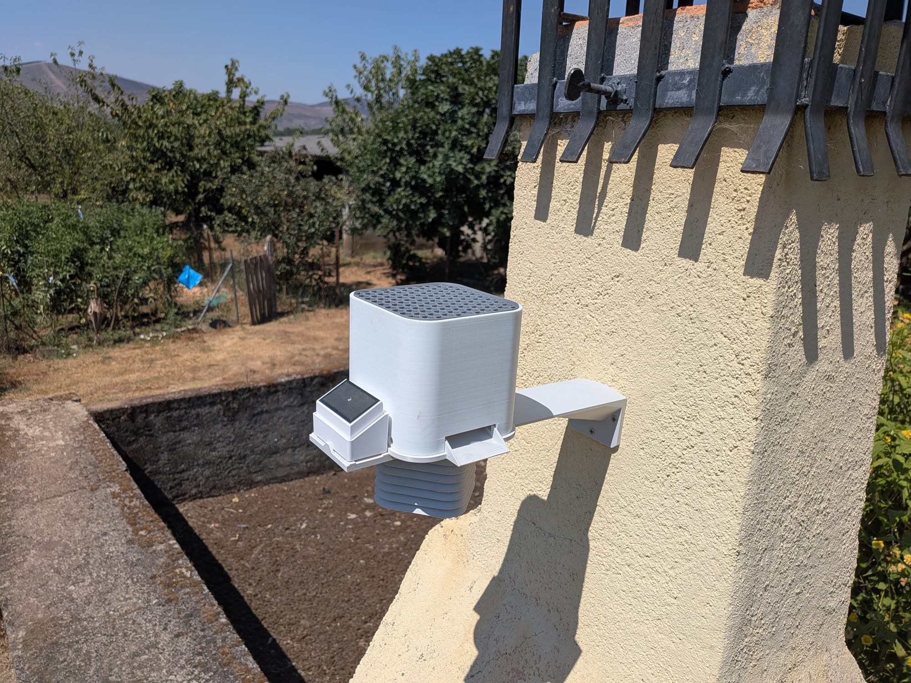
</p>

## Features

| Parameter | Value |
|---|---|
| Collection area | **100 cm²** (square opening with R20 mm corners, side ≈ 101.7 mm) |
| Volume per tip | **5 ml** → **0.5 mm** of rain |
| Tip sensor | Zigbee door sensor (`binary_sensor.puerta_1_contact`), no ESP needed |
| Material | ASA (UV and weather resistant) |
| Bucket axle | Ø2.5 mm stainless steel, seated directly in the ASA |
| End stops | M3 screws threaded into the part, they set the tipping angle |
| Magnet | Ø3 × 2 mm neodymium magnet on the tipping bucket, triggers the door sensor's reed switch |
| Extras | Stevenson screen, plate rain sensor, storm warning |

## Zigbee sensors used

| Sensor | Purpose | Link |
|---|---|---|
| Door sensor (reed) | Counts the bucket tips | [AliExpress](https://es.aliexpress.com/item/1005007499860935.html) |
| Plate rain sensor | Detects whether it is raining | [AliExpress](https://es.aliexpress.com/item/1005009511764724.html) ⚠️ **not recommended** |
| Temperature / humidity / pressure | Inside the Stevenson screen | [AliExpress](https://es.aliexpress.com/item/1005007307128850.html) |

## Files

| File | Description |
|---|---|
| [`rainmeter.yaml`](rainmeter.yaml) | Home Assistant package: counters, rain/flow sensors, `utility_meter`, pressure trend and storm warning |
| [`dashboard.yaml`](dashboard.yaml) | Weather station dashboard card |
| [`embudo.3mf`](embudo.3mf) | Print project (Bambu Studio) |
| [`3D source/`](3D%20source/) | Model sources: `pluviometro.f3z` (Fusion 360) and `pluviometro.step` |

## Home Assistant installation

1. In `configuration.yaml`:

   ```yaml
   homeassistant:
     packages: !include_dir_named packages
   ```

2. Copy `rainmeter.yaml` to `<config>/packages/rainmeter.yaml`.
3. Change the `entity_id`s to match your hardware (`binary_sensor.puerta_1_contact`, `sensor.termometro_exterior_pressure`).
4. Restart HA (or reload `counter`, `input_datetime` and `template`; `utility_meter` needs a restart).
5. Paste `dashboard.yaml` into a manual card. It uses custom cards from HACS (`mushroom`, `mini-graph-card`, `expander-card`, `card-mod`).


### Main entities

| Entity | Description |
|---|---|
| `counter.rainmeter_tip_count_calibration` | Tips in the calibration session (reset by hand) |
| `counter.rainmeter_tip_count_total` | Total tips (never reset, feeds the `utility_meter`s) |
| `sensor.rainmeter_rain_accumulated` | Rain accumulated in the session (mm) |
| `sensor.rainmeter_flow_rate` | Average flow over the session (mL/s) |
| `sensor.rainmeter_rain_rate_hourly` | Rain in the current hour (mm/h) |
| `sensor.rainmeter_rain_rate_daily` | Rain in the current day (mm/24h) |
| `sensor.rainmeter_pressure_trend` | Pressure trend (hPa/h) |

### Conversions

- Tips → mm: `tips × 0.5`
- mm → mL (100 cm²): `mm × 10`
- mL/s → mm/h (100 cm²): `mL/s × 360`

## Calibrating the end-stop screws

You need a 5 ml syringe and a 100 ml measure.

> **Level the rain gauge before calibrating.** If it is tilted, one side tips earlier than the other and the calibration is wrong.

### 1. Adjust each side (4.6 ml)
1. Let the bucket rest on one side.
2. With the syringe, slowly add **4.6 ml** to the upper bucket.
3. Adjust the M3 end-stop screw on that side until the bucket tips right at 4.6 ml. If it tips too early or too late, turn the screw and repeat.
4. Do the same on the other side.

It is calibrated at 4.6 ml instead of 5 ml for two reasons:
- Water keeps coming in while the bucket is tipping.
- A few drops always stay stuck in the bucket after each tip. The design tries to minimise them, but they never go away completely.

Together, each tip ends up being about 5 ml, which is what `rainmeter.yaml` counts.

### 2. Validate with 100 ml
1. Reset the counter with the **Resetear contador** (reset counter) button on the dashboard (`counter.rainmeter_tip_count_calibration`).
2. Pour **100 ml very slowly** into the gauge opening.
3. It should read **20 tips** (accumulated = 10 mm).
4. The **Flujo** (flow) sensor (`sensor.rainmeter_flow_rate`) must not go above **6 ml/s**. At 12 ml/s about 15 % is lost (see [Flow test](#flow-test)).

If you get more than 20 tips, each tip holds less than 5 ml: adjust the stops so it tips with a little more water. If you get fewer, do the opposite. Repeat until you get 20.

### 3. Check again in the final installation
Once it is mounted in place, level it again and repeat the 100 ml validation. Screwing on the bracket can leave it slightly tilted and shift the tipping point.

## Design notes

### Tipping bucket
- Double V-shaped bucket (1.6 mm wall) on a **Ø2.5 mm stainless steel axle**, with **M3 screw end stops** threaded into the part that set the tipping angle.
- Calibration target, the same one `rainmeter.yaml` uses: **5 ml per tip = 0.5 mm** of rain over 100 cm².
- **Axle height:** higher = cleaner tip but needs more angle; very low = "twitchy" tipping.
- **Chamfer** towards the axle: moves the water's centre of gravity away and makes it tip earlier. Bucket **depth** was the most effective lever to increase volume.
- Balance at the tipping point: `m_water · d_water = m_body · d_body` (water centre of gravity measured in Fusion with *Boundary Fill*).
- With little angular travel after tipping, drops stay trapped; at ~20° hardly any remain.

### Water inlet
- The central wedge was removed: it catapulted the water out. It is better for water to fall into the corner of the bucket.
- Wide-mesh leaf guard (fine meshes splash and clog).

### Asymmetric counting (solved)
When tipping to one side it counted twice, and to the other side once (or not at all). It was not software: the sensor was not centred relative to the two magnet positions. **Moving the sensor 13 mm** fixed it.

That is why `rainmeter.yaml` has **no debounce**. The `Rainmeter - Increment tip counters` automation fires on every `off → on` change of `binary_sensor.puerta_1_contact`, adds one to both counters and uses `mode: queued` so quick consecutive tips are not lost.

### Flow test
Measured with `sensor.rainmeter_flow_rate`, which computes `(tips × 5) / seconds`. The seconds run from the first tip of the session (`input_datetime.rainmeter_flow_start_time`) to the last one. It is an average flow meant for calibration, not an instantaneous rain rate. To convert to mm/h: `mL/s × 360`.

- 6 ml/s (≈ 2160 mm/h) → correct reading (200 ml out of 200 ml).
- 12 ml/s (≈ 4320 mm/h) → ~15 % loss.
- Both are far above any real rainfall (records are around 300 mm/h over 1 min).

### Storm warning
A `derivative` sensor (`sensor.rainmeter_pressure_trend`, 20 min window) computes the pressure trend in hPa/h from `sensor.termometro_exterior_pressure`. The `Rainmeter - Storm Warning` automation:

- Fires when the trend drops below **−3 hPa/h** (storm approaching) or rises above **+3 hPa/h** (gust front already arriving), held for **2 min**.
- Has a **90 min cooldown**, so the pressure recovering after a spike does not count as a new storm.
- Sends `notify.notify` and a `persistent_notification` with a fixed `notification_id` (it updates instead of piling up).

**Why a 20 min window:** the derivative was simulated over 10 days of pressure history, including the storm on 03/10/2026. With 30 min the trend barely reached +3.2 hPa/h and did not hold for 2 min, so it **would not have warned**. With 20 min it would have warned about 14 min before the heavy rain, with no false alarms in those 10 days. With 15 min or less, the sensor's 0.1 hPa steps already cause false alarms.

### Zigbee sensor care
- Door sensors are not waterproof: keep the reed switch and magnet away from water.
- Zigbee latency and battery drain during very heavy rain.

## Gallery

### Installed

<table>
  <tr>
    <td>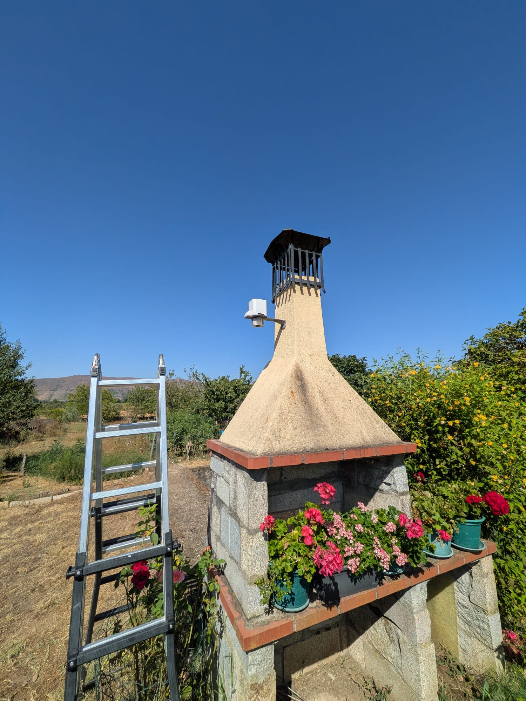</td>
    <td>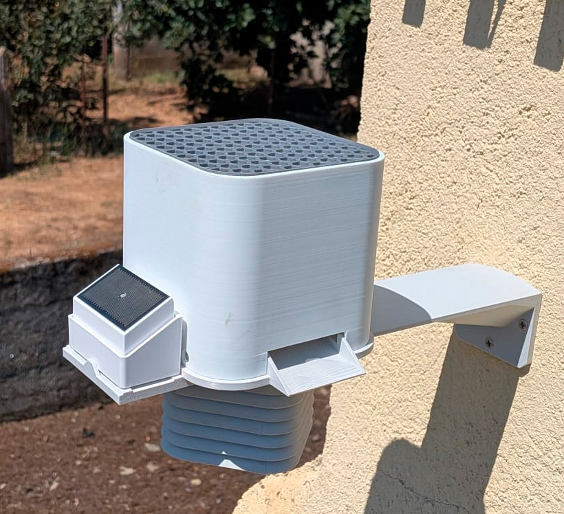</td>
    <td>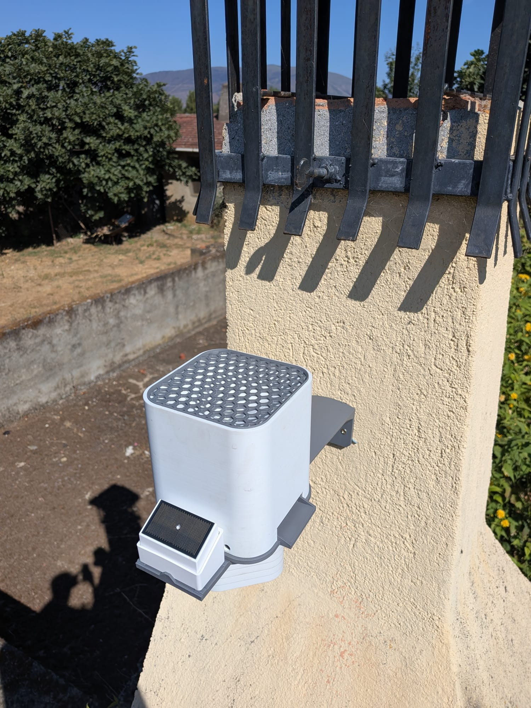</td>
  </tr>
  <tr>
    <td align="center" valign="top" width="33%">Overview</td>
    <td align="center" valign="top" width="33%">Close-up</td>
    <td align="center" valign="top" width="33%">View from above</td>
  </tr>
  <tr>
    <td>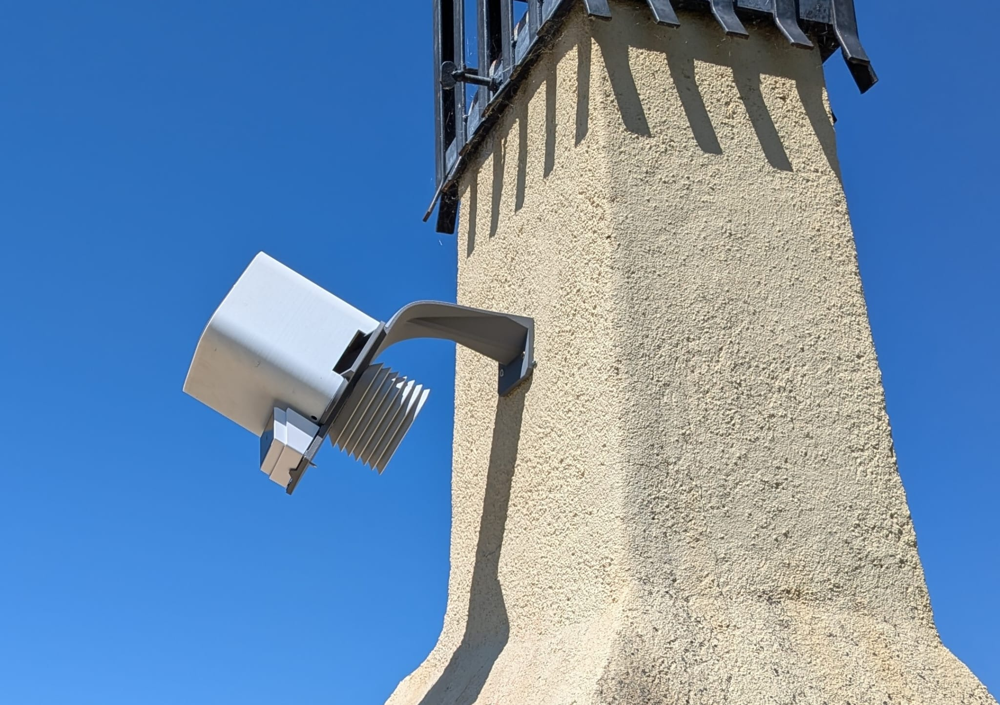</td>
    <td>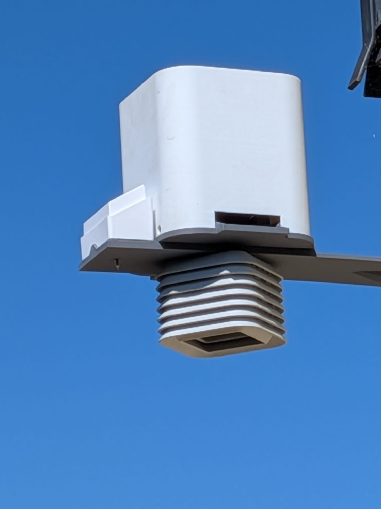</td>
    <td></td>
  </tr>
  <tr>
    <td align="center" valign="top" width="33%">From below<br><sub>The arm in this version was printed in PLA and didn't last even 3 h in the sun</sub></td>
    <td align="center" valign="top" width="33%">Stevenson screen</td>
    <td align="center" valign="top" width="33%">Installed</td>
  </tr>
</table>

### Assembly

<table>
  <tr>
    <td>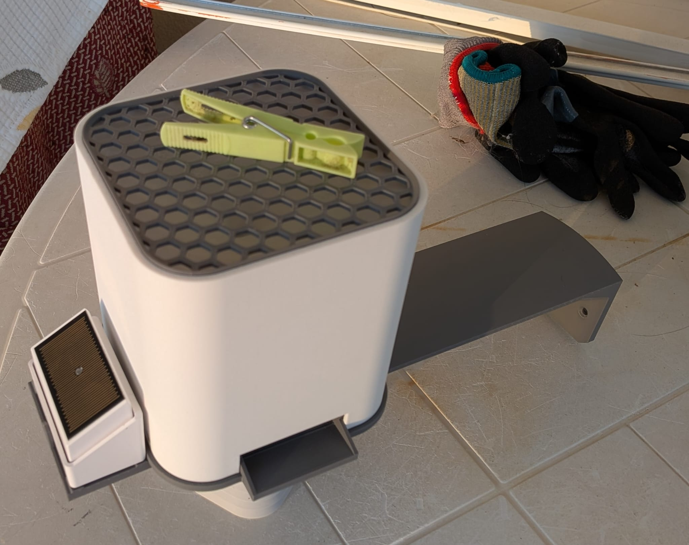</td>
    <td>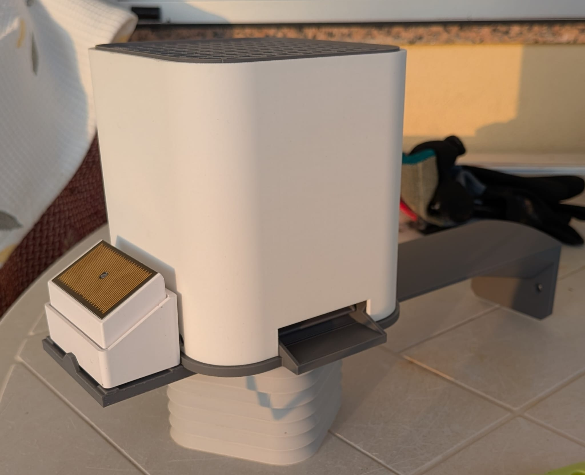</td>
    <td>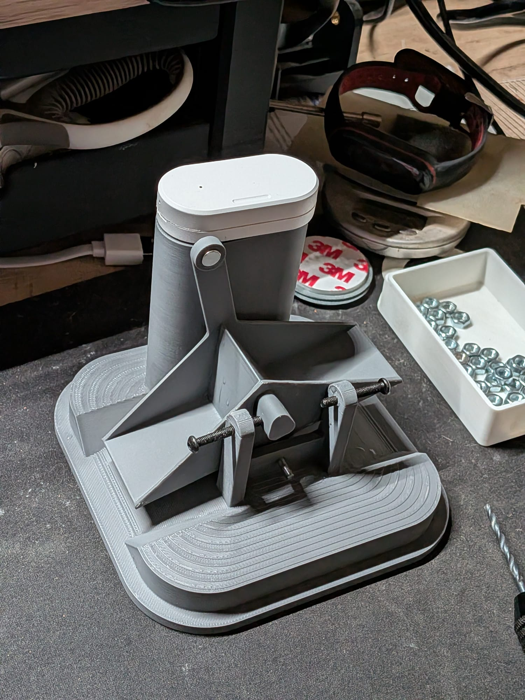</td>
  </tr>
  <tr>
    <td align="center">Leaf guard</td>
    <td align="center">Side view</td>
    <td align="center">Tipping bucket, end stops and door sensor</td>
  </tr>
</table>

### 3D design (Fusion 360)

<table>
  <tr>
    <td>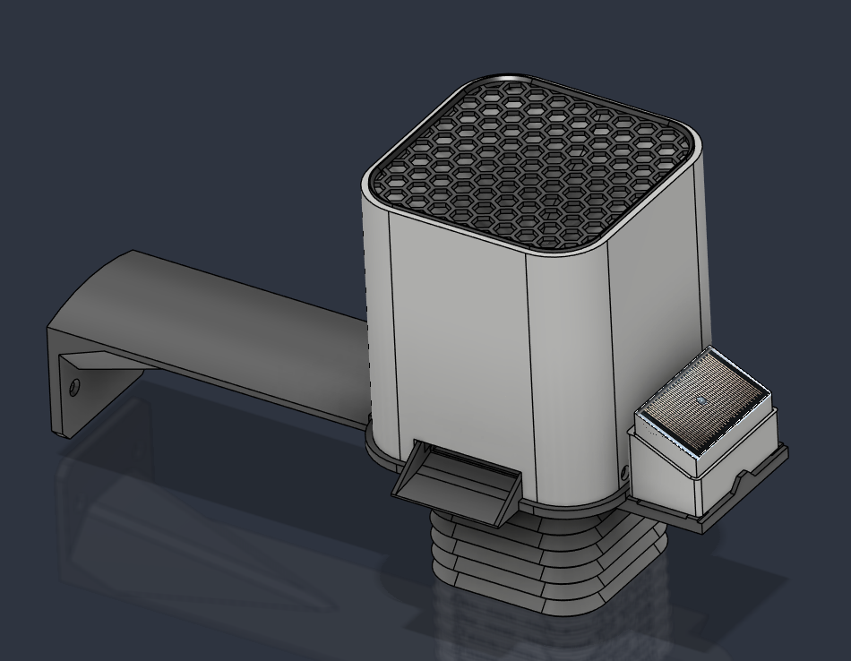</td>
    <td>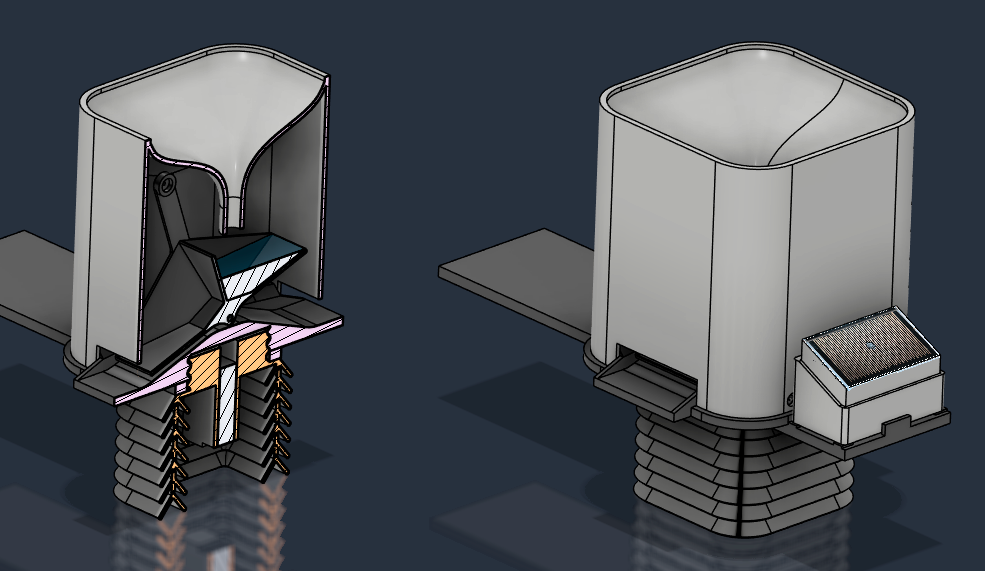</td>
    <td>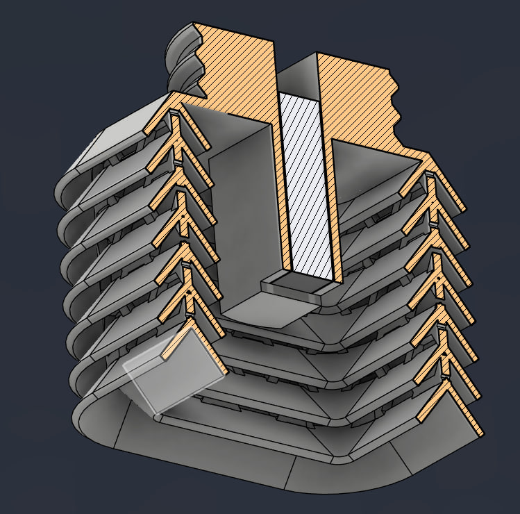</td>
  </tr>
  <tr>
    <td align="center">Full render</td>
    <td align="center">Cross-section: funnel and bucket</td>
    <td align="center">Cross-section: Stevenson screen</td>
  </tr>
</table>

### Home Assistant

<p align="center">
  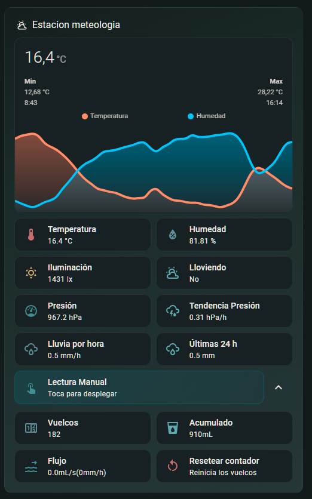
</p>
